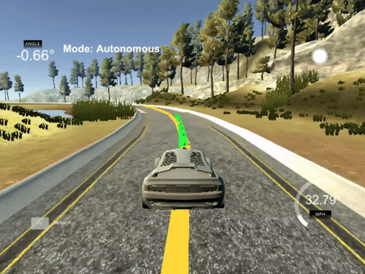

[img1]: ./images/img1.PNG
[img2]: ./images/img2.PNG

## Project: Model Predicitive Controller
[](http://www.udacity.com/drive)

<p align="center"> 

</p>

Video link:  [result](https://www.youtube.com)
## Introduction

The goal of this project is to implement Model Predictive Control in C++ to drive the car around the track using a simple Global Kinematic Model. Parameters were tuned in order to reach maximal speed. The Udacity-provided simulator communicates telemetry and track waypoint data via websocket and the application sends steering and acceleration commands back to the simulator. The solution is robust to 100ms latency, as one may encounter in real-world application.

This project makes use of the IPOPT and CPPAD libraries to calculate an optimal trajectory and its associated actuation commands in order to minimize error with a third-degree polynomial fit to the given waypoints. The optimization considers only a short duration's worth of waypoints, and produces a trajectory for that duration based upon a model of the vehicle's kinematics and a cost function based mostly on the vehicle's cross-track error (roughly the distance from the track waypoints) and orientation angle error, with other cost factors included to improve performance.

## The Model

The kinematic model includes the vehicle's x and y coordinates, orientation angle (psi), and velocity, as well as the cross-track error and psi error (epsi). Actuator outputs are acceleration and delta (steering angle). The model combines the state and actuations from the previous timestep to calculate the state for the current timestep based on the equations below:

![alt text][img1]

Stearing angle (δ) should be in range [-25,25] deg. For simplicity the throttle and brake represented as a singular actuator (a), with negative values signifying braking and positive values signifying acceleration. It should be in range [-1,1]. Cross track error (cte) and ψ error (eψ) were used to build the cost function for the MPC. They could be updated on a new time step using the following equations:

![alt text][img2]

Lf measures the distance between the front of the vehicle and its center of gravity. The parameter was provided by Udacity.


## Timestep Length and Elapsed Duration (N & dt)

The time horizon (T) was chosen to 1 s after experiments. It was shown that the MPC could drive safely around the track with T = 1 s. Time step duration (dt) was set equal to the latancy of the simulation (0.1 s), hense, 10 time steps (N) was used. The cost function parameters were tuned by try-and-error method.

## Polynomial Fitting and MPC Preprocessing

The waypoints are transformed into the vehicle coordinate space and a 3d order polynomial was fitted to the data. This simplifies the process to fit a polynomial to the waypoints because the vehicle's x and y coordinates are now at the origin (0, 0) and the orientation angle is also zero.

The latency was introduced to simulate real delay of a human driver or physical actuators in case of a self driving car. Cross track error and orientation error were calculated and then passed into the MPC Solver.

## Model Predictive Control with Latency

The original kinematic equations depend upon the actuations from the previous timestep, but with a delay of 100ms the actuations are applied another timestep later, so the equations have been altered to account for this.

Also, in addition to the cost functions suggested in the lessons (punishing CTE, epsi, difference between velocity and a reference velocity, delta, acceleration, change in delta, and change in acceleration) an additional cost penalizing the combination of velocity and delta was included and results in much more controlled cornering.

---

## Dependencies

* cmake >= 3.5
 * All OSes: [click here for installation instructions](https://cmake.org/install/)
* make >= 4.1(mac, linux), 3.81(Windows)
  * Linux: make is installed by default on most Linux distros
  * Mac: [install Xcode command line tools to get make](https://developer.apple.com/xcode/features/)
  * Windows: [Click here for installation instructions](http://gnuwin32.sourceforge.net/packages/make.htm)
* gcc/g++ >= 5.4
  * Linux: gcc / g++ is installed by default on most Linux distros
  * Mac: same deal as make - [install Xcode command line tools]((https://developer.apple.com/xcode/features/)
  * Windows: recommend using [MinGW](http://www.mingw.org/)
* [uWebSockets](https://github.com/uWebSockets/uWebSockets)
  * Run either `install-mac.sh` or `install-ubuntu.sh`.
  * If you install from source, checkout to commit `e94b6e1`, i.e.
    ```
    git clone https://github.com/uWebSockets/uWebSockets
    cd uWebSockets
    git checkout e94b6e1
    ```
    Some function signatures have changed in v0.14.x. See [this PR](https://github.com/udacity/CarND-MPC-Project/pull/3) for more details.

* **Ipopt and CppAD:** Please refer to [this document](https://github.com/udacity/CarND-MPC-Project/blob/master/install_Ipopt_CppAD.md) for installation instructions.
* [Eigen](http://eigen.tuxfamily.org/index.php?title=Main_Page). This is already part of the repo so you shouldn't have to worry about it.
* Simulator. You can download these from the [releases tab](https://github.com/udacity/self-driving-car-sim/releases).
* Not a dependency but read the [DATA.md](./DATA.md) for a description of the data sent back from the simulator.


## Basic Build Instructions

1. Clone this repo.
2. Make a build directory: `mkdir build && cd build`
3. Compile: `cmake .. && make`
4. Run it: `./mpc`.

## Tips

1. It's recommended to test the MPC on basic examples to see if your implementation behaves as desired. One possible example
is the vehicle starting offset of a straight line (reference). If the MPC implementation is correct, after some number of timesteps
(not too many) it should find and track the reference line.
2. The `lake_track_waypoints.csv` file has the waypoints of the lake track. You could use this to fit polynomials and points and see of how well your model tracks curve. NOTE: This file might be not completely in sync with the simulator so your solution should NOT depend on it.
3. For visualization this C++ [matplotlib wrapper](https://github.com/lava/matplotlib-cpp) could be helpful.)
4.  Tips for setting up your environment are available [here](https://classroom.udacity.com/nanodegrees/nd013/parts/40f38239-66b6-46ec-ae68-03afd8a601c8/modules/0949fca6-b379-42af-a919-ee50aa304e6a/lessons/f758c44c-5e40-4e01-93b5-1a82aa4e044f/concepts/23d376c7-0195-4276-bdf0-e02f1f3c665d)
5. **VM Latency:** Some students have reported differences in behavior using VM's ostensibly a result of latency.  Please let us know if issues arise as a result of a VM environment.

